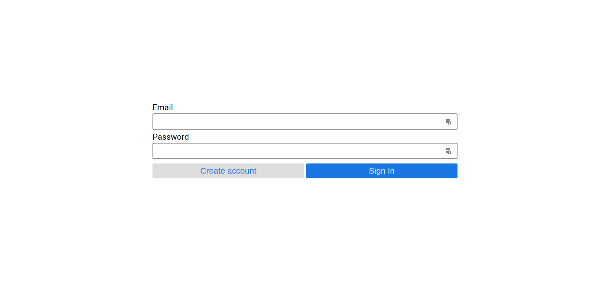
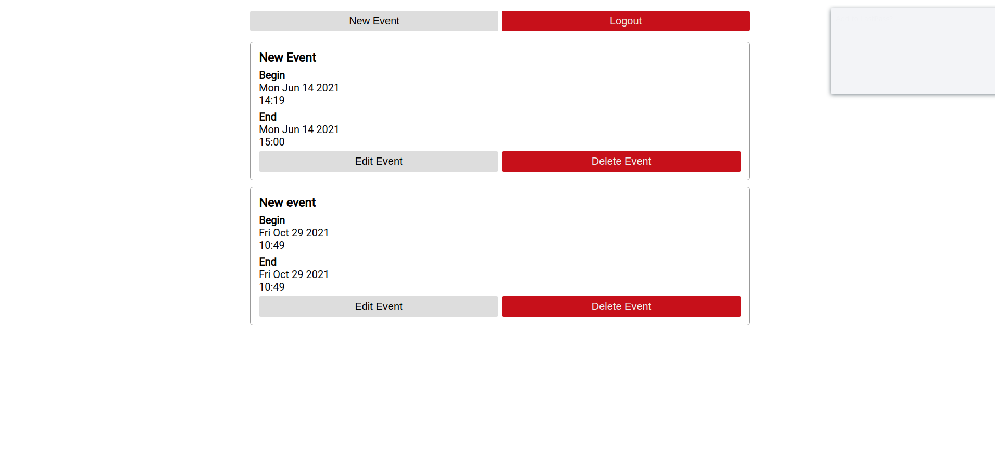

# Scheduling App

Scheduling App is a web application to help the user's schedule management.

# About
An user is allowed to create an account and create/edit/delete events it owns.




# Front-End
The front-end was built using ```create-react-app```. 

To install dependencies, use ```yarn install```.

 To run it, use ```yarn start```. The default port is 3000.

# Back-End
The Back-End is REST api built using NodeJS. The database communication is done through knex library. 

To install dependencies, use ```npm install```.

To run it locally use ```npm start```. The default port is 3030.
